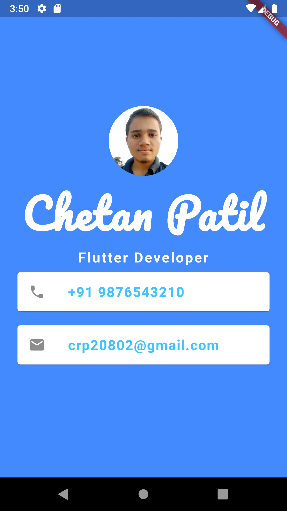

# 100-days-of-flutter

### Day-1

-   Completed All [Installations required](https://docs.flutter.dev/get-started/install/windows) for Flutter.
    -   [x] Install Flutter
    -   [x] Install Dart
    -   [x] Install Android Studio
    -   [x] Install Android SDK Emulator

### Day-2

-   Completed intro App in flutter
    -   [x] Learn how to create a flutter app
    -   [x] Learn the structure of a flutter app
    -   [x] Learn how to add images and fonts in app
    -   [x] Learn how to Center widget
    -   

### Day-3

-   Started Learning Dart for flutter.
    -   [x] Datatypes
    -   [x] Variables
    -   [x] List and Map
    -   [x] Functions

### Day-4

-   Finished required Dart for flutter
    -   [x] Conditional Statements & Loops
    -   [x] constructors
    -   [x] JSON handling - [quicktype](https://quicktype.io/)
    -   [x] Async and Await
    -   [x] Future(like promise in js)

### Day-5

-   Started Dice rolling app
    -   [x] Learn about animations
    -   [x] Learn about gestures
    -   [x] Learn about controllers
    -   [x] Learn about state management

### Day - 6

-   Finished Dice Rolling app
    -   [x] Create app icon from [appicon](https://appicon.co/).
    -   [x] `rolling_Dice/android/app/src/main/res` - change app icon
    -   [x] Learn implementing splash screen.
        1. ```dart
            onDoneLoading(){
               Navigator.of(context)
               .pushReplacement(MaterialPageRoute(builder: (context)=>HomeScreen()))
            }
           ```
            With Stateful SplashScreen widget.
        2. pub.dev - [Animated splash screen](https://pub.dev/packages/animated_splash_screen)
        3. The flutter way - android - `rolling_Dice/android/app/src/main/res/Drawable` - change `launch_background.xml`
