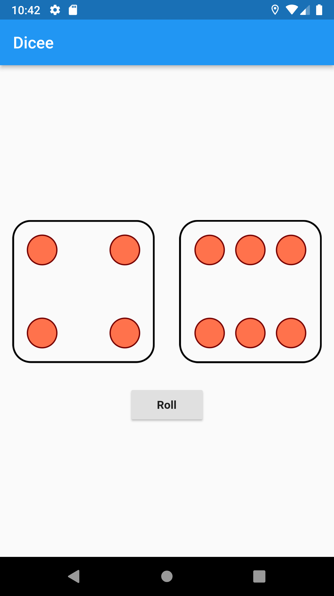

# 100-days-of-flutter

---

## Resource (Day 1-8) : [Code help flutter series Hindi](https://www.youtube.com/playlist?list=PLDzeHZWIZsTo3Cs115GXkot28i406511Y)

### Day-1

-   Completed All [Installations required](https://docs.flutter.dev/get-started/install/windows) for Flutter.
    -   [x] Install Flutter
    -   [x] Install Dart
    -   [x] Install Android Studio
    -   [x] Install Android SDK Emulator

### Day-2

-   Completed intro App in flutter
    -   [x] Learned how to create a flutter app
    -   [x] Learned the structure of a flutter app
    -   [x] Learned how to add images and fonts in app
    -   [x] Learned how to Center widget
    -   [x] 

### Day-3

-   Started Learneding Dart for flutter.
    -   [x] Datatypes
    -   [x] Variables
    -   [x] List and Map
    -   [x] Functions

### Day-4

-   Finished required Dart for flutter
    -   [x] Conditional Statements & Loops
    -   [x] constructors
    -   [x] JSON handling - [quicktype](https://quicktype.io/)
    -   [x] Async and Await
    -   [x] Future(like promise in js)

### Day-5

-   Started Dice rolling app
    -   [x] Learned about animations
    -   [x] Learned about gestures
    -   [x] Learned about controllers
    -   [x] Learned about state management

### Day - 6

-   Finished Dice Rolling app
    -   [x] Create app icon from [appicon](https://appicon.co/).
    -   [x] `rolling_Dice/android/app/src/main/res` - change app icon
    -   [x] Learned implementing splash screen.
        1. ```dart
            onDoneLoading(){
               Navigator.of(context)
               .pushReplacement(MaterialPageRoute(builder: (context)=>HomeScreen()))
            }
           ```
            With Stateful SplashScreen widget.
        2. pub.dev - [Animated splash screen](https://pub.dev/packages/animated_splash_screen)
        3. The flutter way - android - `rolling_Dice/android/app/src/main/res/Drawable` - change `launch_background.xml`
    -   [x] 

### Day - 7

-   Flutter UI break-down

### Day - 8

-   Completed piano game application
    -   [x] Lear about plugins
    -   [x] Learned about audio in flutter
-   FlutterFire
    -   [x] Lear about flutter + firebase = flutterFire
    -   [x] Phone Authentication using firebase

---

## Resource (Day 9-15) : [Codepur hindi flutter series](https://www.youtube.com/playlist?list=PLrjrqTcKCnhTXI2GyPkaQF47inLp6LoIC)

### Day - 9

-   Started flutter catalog app
    -   [x] Learned about flutter Routes & Theme

### Day - 10

-   Worked on Login Page
    -   [x] Created input fields for Username & Password(with obscureText)
    -   [x] Learned ElevatedButton
    -   [x] Learned to use async and await
    -   [x] Learned to use Future
    -   [x] Learned to use animations
    -   [x] Learned about InkWell, BoxDecoration, BorderRadius

### Day - 11

-   finshed work on login page, started working on drawer
    -   [x] Learned about validators
    -   [x] Learned about devtools, flutter inspecter
    -   [x] Customized drawer
    -   [x] Created models for Item

### Day - 12

-   [x] Learned about context & constraints
-   [x] Applied card and list view
-   [x] worked on json with the help of Dart:convert

### Day - 13

-   [x] Improved UI with the help of VelocityX package

### Day - 14

-   [x] Created detail page of Item.
-   [x] Implimented dark mode.

### Day - 15

-   [x] Completed flutter catalog.

---

## 15 Days Flutter UI Challenge (Day:16-30)

-   [ ] [WhatsApp UI Clone](https://github.com/chetan6780/WhatsApp-UI-Clone)
-   [ ] [Instagram UI Clone](#)

### Day - 16

-   WhatsApp UI Clone started
    -   [x] Created app with `flutter create whatsapp_ui_clone`

---

### Day - 31

-   [ ] Revise all the Dart Concepts.
-   [ ] Review all code Written so far.
